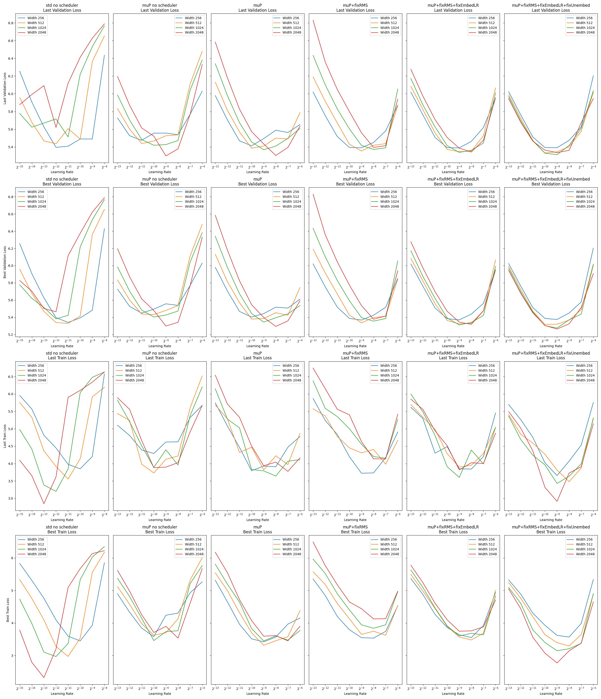

# Small-scale experiments with muP and autoregressive transformers
## Overview
This code provides a configurable implementation of muP with some of the tweaks proposed by [EleutherAI](https://blog.eleuther.ai/mutransfer/) and some of the tweaks taken from [unit-scale muP](https://arxiv.org/abs/2407.17465).

The first version was implemented by Berke Argin, you can find it [here](https://github.com/BerkeArgin/muP-autoregressive).

With all tweaks applied, the optimal learning rate does seem to transfer between transformer sizes both for training and validation losses:


You will need to zoom into the image to distinguish things properly. Each row represents one target metric (Last vs best epoch validation loss, last vs best epoch training loss). Each column represents a variant of the training pipeline. From left to right:
- Standard parameterization
- A variant of muP with incorrect scaling of the embedding learning rate
- Same as above, but instead of LayerNorm this uses RMSNorm without a learnable gain
- Same as above, but the embedding learning rate is scaled correctly
- Same as above, but the logits are scaled with the square root of the width of the network, rather than with the width as suggested by EleutherAI. This correction seems to be necessary due to us using untied unembedding matrix, whereas EleutherAI uses the same parameters for embedding and unembedding.

As we can see, the transfer slowly improves with each modification, even though sometimes (eg in the case of RMSNorm), we loose some of the evaluation performance of the larger models.

## Getting started

### Code and development environment
We support the following methods and platforms for installing the project dependencies and running the code.

- **Docker/OCI-container for AMD64 machines (+ NVIDIA GPUs)**:
  This option works for machines with AMD64 CPUs and NVIDIA GPUs.
  E.g. Linux machines (EPFL HaaS servers, VMs on cloud providers),
  Windows machines with WSL, and clusters running OCI-compliant containers,
  like the EPFL Run:ai (Kubernetes) clusters.

  Follow the instructions in `installation/docker-amd64-cuda/README.md` to install the environment
  then get back here for the rest of the instructions to run the experiments.

  We ran our experiments on TODO: FILL IN THE HARDWARE YOU USED.
  To run them, you should have at least TODO: FILL IN THE MINIMUM HARDWARE REQS IF APPLICABLE.

- **Conda for osx-arm64**
  This option works for macOS machines with Apple Silicon and can leverage MPS acceleration.

  Follow the instructions in `installation/conda-osx-arm64-mps/README.md` to install the environment
  then get back here for the rest of the instructions to run the experiments.

  We ran our experiments on TODO: FILL IN THE HARDWARE YOU USED.
  To run them, you should have at least TODO: FILL IN THE MINIMUM HARDWARE REQS IF APPLICABLE.

### Data

> [!IMPORTANT]
> **TEMPLATE TODO**:
> Fill `data/README.md` or delete this section, then delete this note.

Refer to `data/README.md`.

### Logging and tracking experiments

We use [Weights & Biases](https://wandb.ai/site) to log and track our experiments.
If you're logged in, your default entity will be used (a fixed entity is not set in the config),
and you can set another entity with the `WANDB_ENTITY` environment variable.
Otherwise, the runs will be anonymous (you don't need to be logged in).

## Reproduction and experimentation

### Reproducing our results

> [!IMPORTANT]
> **TEMPLATE TODO**:
> Keep these scripts up to date and run your experiments using them.
> Do provide the W&B runs and trained models or update this section.
> Delete this note when shipping.

We provide scripts to reproduce our work in the `reproducibility-scripts/` directory.
It has a README at its root describing which scripts reproduce which experiments.

We share our Weights and Biases runs in [this W&B project](https://wandb.ai/claire-labo/mup).

Moreover, we make our trained models available.
You can follow the instructions in `outputs/README.md` to download and use them.

## Contributing

We use [`pre-commit`](https://pre-commit.com) hooks to ensure high-quality code.
Make sure it's installed on the system where you're developing
(it is in the dependencies of the project, but you may be editing the code from outside the development environment.
If you have conda you can install it in your base environment, otherwise, you can install it with `brew`).
Install the pre-commit hooks with

```bash
# When in the PROJECT_ROOT.
pre-commit install --install-hooks
```

Then every time you commit, the pre-commit hooks will be triggered.
You can also trigger them manually with:

```bash
pre-commit run --all-files
```

## Licenses and acknowledgements

This project is licensed under the LICENSE file in the root directory of the project.

The initial mup implementation was done by Berke Argin.

The initial code of this repository has been initiated by the [Python Machine Learning Research Project Template](https://github.com/CLAIRE-Labo/python-ml-research-template)
with the LICENSE.ml-template file.

Additional LICENSE files may be present in subdirectories of the project.
